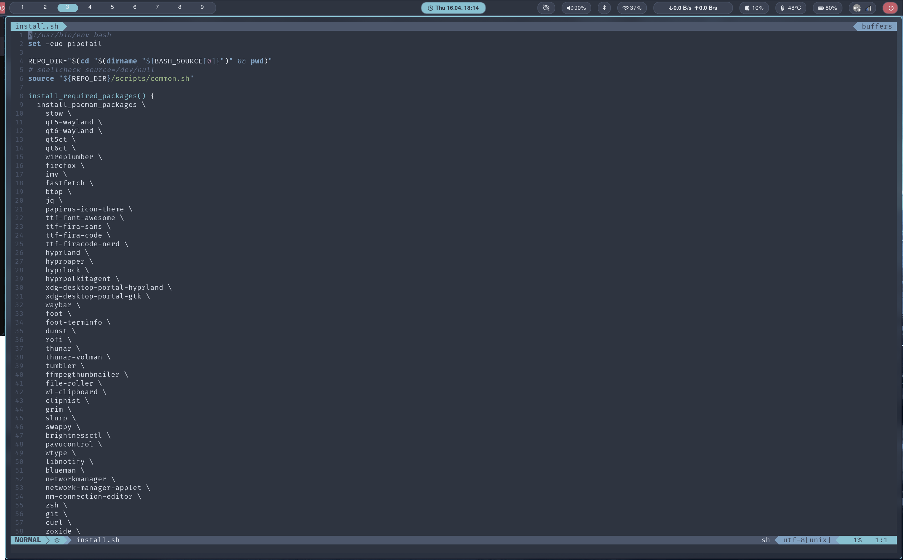
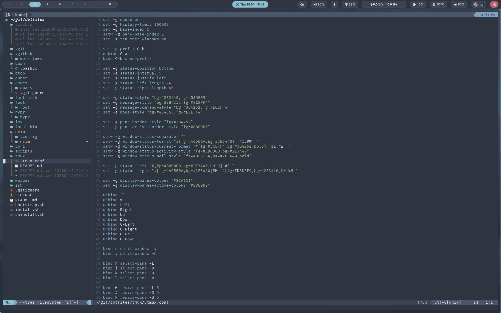

# Neovim

A small, keyboard-focused Neovim setup for my dotfiles.

It uses a local Nord theme, vim-airline, Telescope, and Neo-tree with automatic preview on the right.

## Screenshots

### Normal editing view



### File finder with preview



## Features

- local **Nord** theme vendored into the repo
- **vim-airline** with Nord styling and powerline separators
- **Neo-tree** as a file finder on the left
- automatic **preview pane on the right** while navigating in Neo-tree
- **Telescope** for file search and live grep
- hidden files enabled in file search
- Nerd Font based terminal setup for proper symbols
- simple Lua config layout

## Layout

```text
nvim/
└── nvim
    ├── autoload
    │   ├── airline
    │   │   └── themes
    │   │       └── nord.vim
    │   └── lightline
    │       └── colorscheme
    │           └── nord.vim
    ├── colors
    │   └── nord.vim
    ├── init.lua
    ├── lazy-lock.json
    ├── README.md
    └── lua
        ├── config
        │   ├── keymaps.lua
        │   ├── lazy.lua
        │   └── options.lua
        └── plugins
            ├── colorschemes.lua
            ├── telescope.lua
            └── ui.lua
```

## Theme

This setup uses a **local copy** of the Nord Vim theme instead of depending on an external colorscheme plugin at runtime.

Relevant files:

- `nvim/nvim/colors/nord.vim`
- `nvim/nvim/autoload/airline/themes/nord.vim`
- `nvim/nvim/autoload/lightline/colorscheme/nord.vim`

The main theme options are set in `init.lua`.

## Plugins

The setup is intentionally small.

### Core plugin manager

- `folke/lazy.nvim`

### Search

- `nvim-telescope/telescope.nvim`
- `nvim-lua/plenary.nvim`

### UI

- `vim-airline/vim-airline`
- `vim-airline/vim-airline-themes`
- `nvim-neo-tree/neo-tree.nvim`
- `nvim-tree/nvim-web-devicons`
- `MunifTanjim/nui.nvim`

## Keybindings

### General

- `Space` is the leader key
- `Ctrl+s` saves the current file
- `Space q` quits the current window
- `Esc` clears search highlighting

### File finder

- `Space e` opens Neo-tree with preview
- `j` / `k` moves through the file list
- arrow keys also work for navigation
- `l` or right arrow toggles a folder
- `h` or left arrow closes a folder
- `Backspace` goes to the parent directory
- `P` toggles preview
- `Esc` reverts preview
- `q` closes the Neo-tree window
- `H` toggles hidden files
- `R` refreshes the tree

## Telescope

- `Space f f` find files
- `Space f g` live grep
- `Space f b` list buffers
- `Space f h` help tags
- `Space f r` find files from repository root
- `Space g r` live grep from repository root
- `Space f .` find files from current directory
- `Space g .` live grep from current directory
- `Space f ~` find files from home directory
- `Space g ~` live grep from home directory
- `Space f /` find files from filesystem root
- `Space g /` live grep from filesystem root

## File finder behavior

The Neo-tree setup is used as a **finder + preview** panel, not as a full editing surface.

That means:

- the tree stays on the left
- the preview opens on the right
- moving through files updates the preview
- common direct-open mappings were disabled so the tree behaves more like a browser

## Requirements

This setup is meant for Arch Linux and is installed through the repo's `install.sh`.

Important packages for the Neovim setup include:

- `neovim`
- `ripgrep`
- `git`
- `curl`
- `stow`
- `foot`
- `ttf-firacode-nerd`

## Installation

From the repository root:

```bash
bash install.sh
```

## Restow only Neovim

```bash
stow --no-folding --restow --dir ~/git/dotfiles --target "$HOME/.config" nvim
```

## Notes

- The statusline symbols need a Nerd Font.
- The current terminal setup uses **FiraCode Nerd Font Mono** in Foot.
- Telescope search relies on `ripgrep`.
- Plugins are managed through `lazy.nvim`.

## Git Integration

This setup includes Git support directly inside Neovim.

### Plugins

- `gitsigns.nvim` for inline Git hunks, blame, and diff actions
- `neogit` for a Git interface inside Neovim
- `diffview.nvim` as an additional dependency for Git diffs
- `plenary.nvim` as a required dependency for Neogit

### Keybinds

#### Gitsigns

    ]h            go to next hunk
    [h            go to previous hunk
    <leader>hs    stage hunk
    <leader>hr    reset hunk
    <leader>hp    preview hunk
    <leader>hb    blame current line
    <leader>hd    diff current file
    <leader>tb    toggle current line blame

#### Neogit

    <leader>gg    open Neogit

### Install

After adding the plugin file, run:

    cd ~/git/dotfiles
    stow -R nvim
    nvim --headless "+Lazy! sync" +qa
